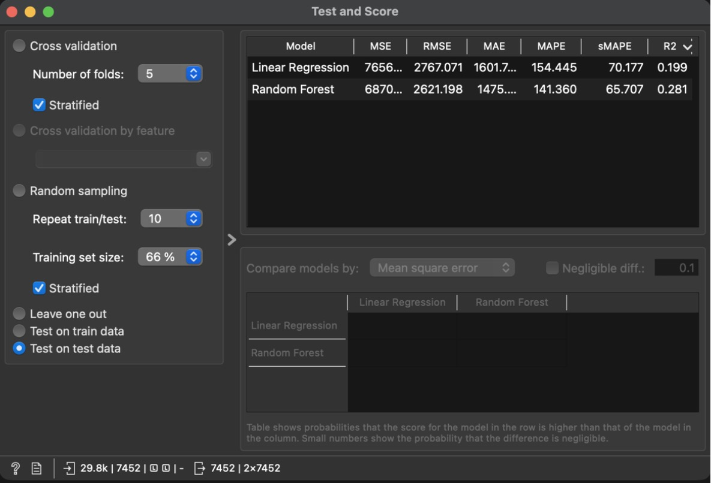
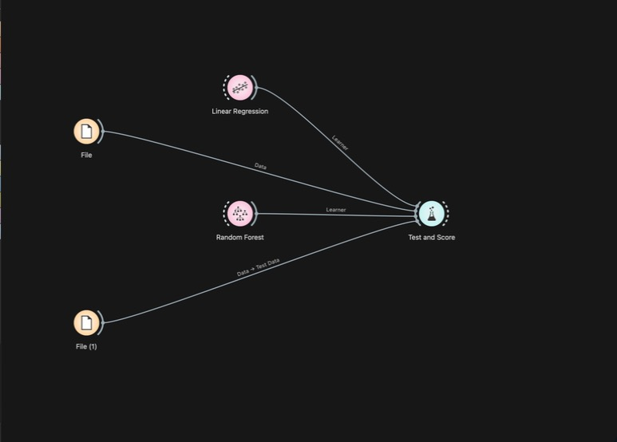
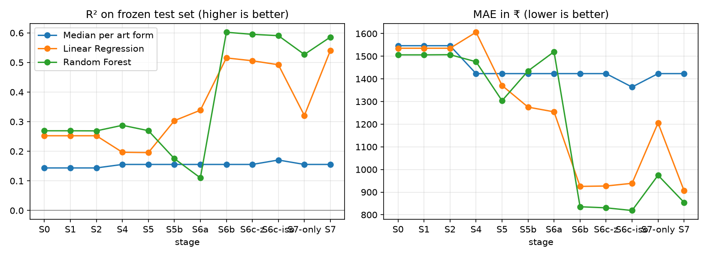

# Experiments

All scores are on the **frozen test set**, in rupees on the original price. Source:
`reports/models/experiments.csv`, written by `scripts/evaluate_stage.py`. Split:
`scripts/make_split.py`.

## The frozen split (v3, 2026-10-04)

| | Value |
|---|---|
| Train / test rows | 29,805 / 7,452 (20.0% test) |
| Grouping | **Product family**: rows are joined when they share a `variant_group`, an identical description, **or near-identical text** (TF-IDF cosine ≥ 0.8 on title + description). A family goes entirely to one side. 2,575 families; the largest has 629 rows (1.7%) |
| Stratified by | `primary_artform` (16 small art forms ended up train-only and 2 test-only; grouping takes priority) |
| Shared variant groups / descriptions across sides | 0 / 0 |
| Test rows with a ≥ 0.9-similar training row | 1.5% (v2: 72%) |
| "Copy the most similar training item's price" | R² 0.255 (v2: 0.841) |
| Median price, train / test | ₹850 / ₹890 |

### Why it took three versions

The catalogue lists many near-copies of one product: colour, size and design variants with
lightly reworded text. A random split puts near-copies on both sides, and the test then checks
*memory*, not *pricing ability*.

| Version | Grouped by | Leak found | Effect |
|---|---|---|---|
| v1 | `variant_group` (same title + price) | 71% of test rows shared an exact description with training | RF R² inflated to 0.788 |
| v2 | + identical description | 72% of test rows still had a ≥ 0.9-similar training row ("Mint Green - Saanjh Bela … Earrings" vs "Green - Saanjh Bela … Earrings") | Copying the nearest training price alone scored R² 0.841; RF reached 0.857 |
| **v3** | + near-identical text (cosine ≥ 0.8) | — | Copy-nearest falls to 0.255; scores measure pricing of genuinely new products |

**Threshold choice:** 0.8 keeps families product-sized. At 0.7 near-matches chain into one family
of 2,585 rows.

v1 and v2 scores are discarded and appear here only to explain the change.

## Regression — target: price (v3)

| Stage | Change | Feat. | Median / art form R² | Linear R² | Ridge R² | Random Forest R² | Best MAE (₹) | Best MAPE (%) |
|---|---|---|---|---|---|---|---|---|
| S0 | Raw; artform list text as one category | 1 | 0.144 | 0.253 | 0.265 | **0.269** | 1,506 (RF) | 152.3 |
| S1 | Types fixed | 1 | 0.144 | 0.253 | 0.265 | 0.269 | 1,506 | 152.3 |
| S2 | 16 rows removed | 1 | 0.144 | 0.253 | 0.265 | 0.269 | 1,507 | 152.4 |
| S4 | Primary art form + label count | 2 | 0.156 | 0.197 | 0.208 | **0.288** | 1,476 (RF) | 143.2 |
| S5 | log(price) target | 2 | 0.156 | 0.196 | 0.213 | **0.270** | 1,304 (RF) | 94.3 |
| S5b | + title/description length, description-repeat | 5 | 0.156 | **0.303** | 0.292 | 0.175 | 1,266 (Ridge) | 83.5 |
| S6a | + all art-form labels (multi-hot) | 6 | 0.156 | 0.339 | **0.373** | 0.110 | 1,242 (Ridge) | 83.4 |
| S6b | + TF-IDF of title + description | 7 | 0.156 | 0.515 | **0.707** | 0.602 | **730 (Ridge)** | **41.9** |
| S7-only | S6a + 37 knowledge-graph features (no TF-IDF) | 43 | 0.156 | 0.321 | 0.434 | **0.527** | 975 (RF) | 68.6 |
| S7 | S6b + 37 knowledge-graph features | 44 | 0.156 | 0.540 | **0.698** | 0.586 | 749 (Ridge) | 41.7 |

The median baseline (one price for everything) scores R² −0.15 and MAE ₹1,487 on split v3.

**Re-run note (2026-10-04):** S6a onward were re-scored after a cleaning fix (stage S06: a
literal `\u200b` text in one label). The split assignment was verified identical, and scores
moved by at most 0.011 R².

### Outlier handling (step 2.9, training rows only)

| Stage | Change | Ridge R² | Ridge MAE (₹) | Band F1 |
|---|---|---|---|---|
| S6b | All training rows | **0.707** | **730** | 0.767 |
| S6c-z | − 12 z-score rows | 0.705 | 731 | 0.748 |
| S6c-iso | − 293 Isolation Forest rows | 0.691 | 741 | 0.778 |

Decision: keep all rows ([step_09 report](reports/cleaning/step_09_outliers.md)).

### Cross-check in Orange (stage S4)

Orange 3.40 Test and Score, "Test on test data", using the same frozen train/test files
(`data/splits/orange/S4_*.tab`). Workflow:
[`S4_crosscheck_test_and_score.ows`](tool_exports/orange/S4_crosscheck_test_and_score.ows).

| Model | Orange R² | Script R² | Orange MAE (₹) | Script MAE (₹) | Orange MAPE (%) | Script MAPE (%) |
|---|---|---|---|---|---|---|
| Linear Regression | 0.199 | 0.197 | 1,601.7 | 1,606.0 | 154.4 | 155.6 |
| Random Forest | 0.281 | 0.288 | 1,475 | 1,476 | 141.4 | 143.2 |

The two tools agree to within 0.01 R². The small gaps are expected:

- **Linear Regression:** the 2 art forms that occur only in the test set are encoded differently
  (scikit-learn ignores unseen categories; Orange maps them through its own encoder).
- **Random Forest:** different defaults (Orange: 10 trees; script: 200 trees, minimum leaf 2).

| Test and Score | Workflow |
|---|---|
|  |  |

## Classification — price band (low / mid / high, training-set tertiles)

| Stage | Logistic Regression macro-F1 |
|---|---|
| S0–S2 | 0.534 |
| S4–S5 | 0.478 |
| S5b | 0.501 |
| S6a | 0.551 |
| S6b | 0.767 |
| S7-only | 0.612 |
| **S7** | **0.780** |

## Progress chart

## What the stages show

1. **S1, S2: no change.** Structural fixes don't change what a model can learn. Expected.
2. **S4: mixed.** Random Forest rises slightly (0.269 → 0.288); the linear models fall, because one
   primary label loses the label *combinations* that the raw list text encoded.
3. **S5 (log target):** R² roughly flat, percentage error falls sharply (RF MAPE 143 → 94%).
   Log training optimises relative error.
4. **S5b and S6a hurt Random Forest** (0.270 → 0.175 → 0.099) while helping linear models.
   Length and repeat counts let a forest memorise product families; on unseen families that
   memory misleads it. Under the leaky v2 split the same features looked like a big *gain* —
   the clearest demonstration in this project of why the split matters.
5. **S6b: text is the main signal.** The words in the title and description (materials, item
   type, size, craft names) take Ridge from 0.373 to **0.707** and MAE to **₹730**, against
   ₹1,506 at S0. Ridge beats plain Linear Regression here (0.707 vs 0.518), because with
   thousands of word features the unregularised model over-fits; Ridge's penalty prevents that.
6. **Price bands:** F1 0.534 → 0.767 (S6b) → **0.780** (S7).
7. **S7, knowledge-graph features:** without text, they lift Random Forest from 0.110 to **0.527**
   (37 readable features such as handwoven silk, zari, skilled labour). With text, they're largely
   redundant for regression (Ridge 0.707 → 0.698) but improve the price-band classifier. Details:
   [KG_REPORT.md](reports/knowledge_graph/KG_REPORT.md).

## Stages that made scores worse

| Stage | Model | Effect | Reason |
|---|---|---|---|
| S4 | Linear / Ridge | R² −0.06 | Label combinations collapsed into one label |
| S5b | Random Forest | R² −0.10 | Length/repeat features enable family memorisation |
| S6a | Random Forest | R² −0.08 | Same, plus many sparse label columns |
