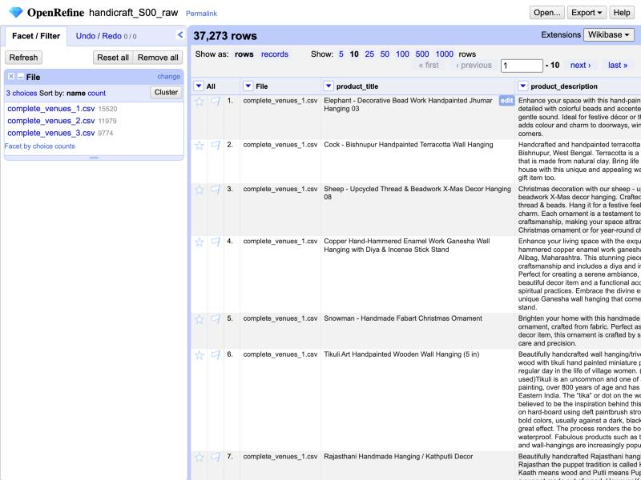
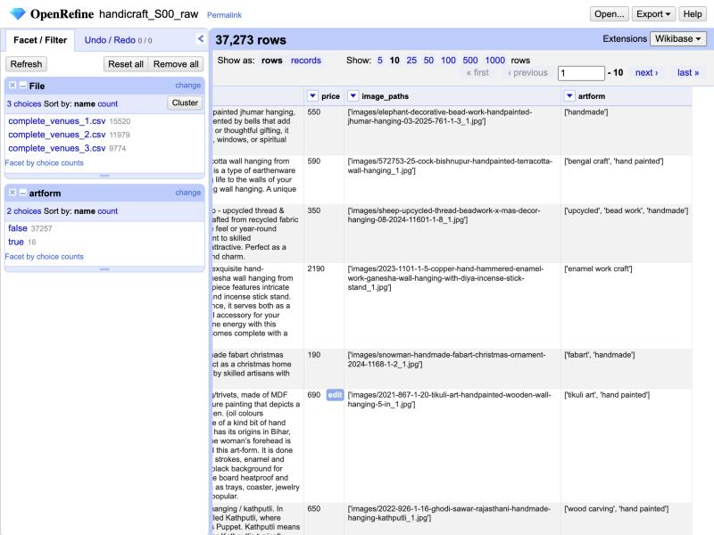
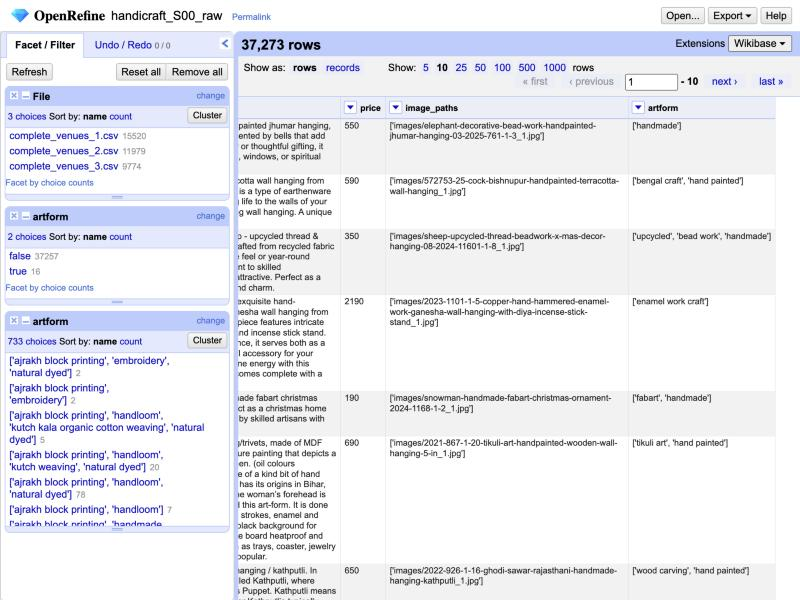
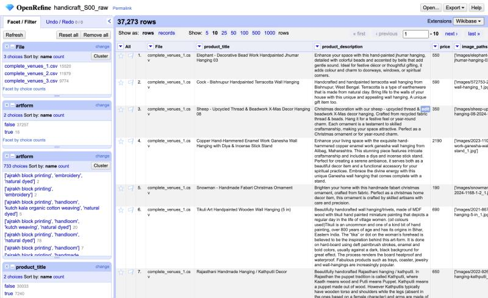
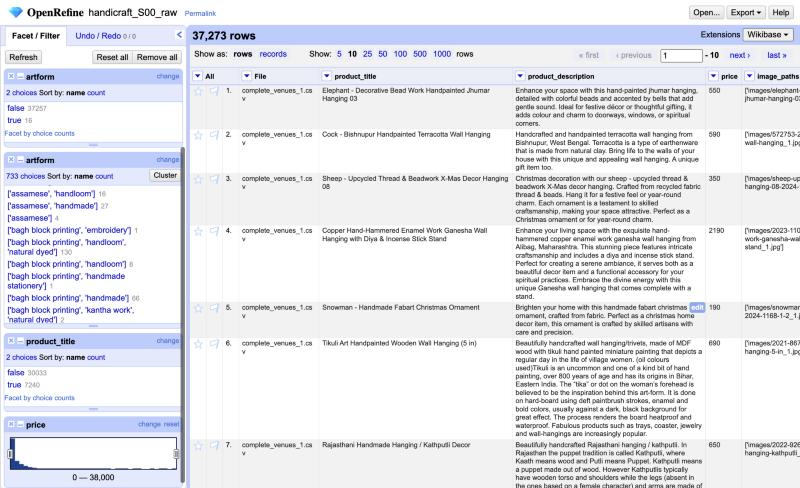
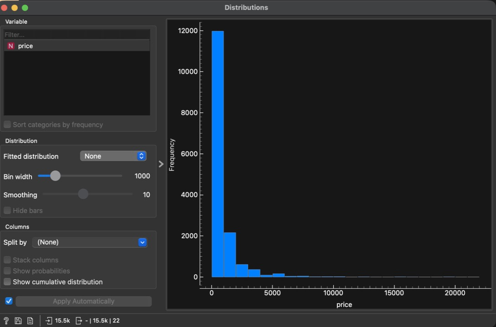
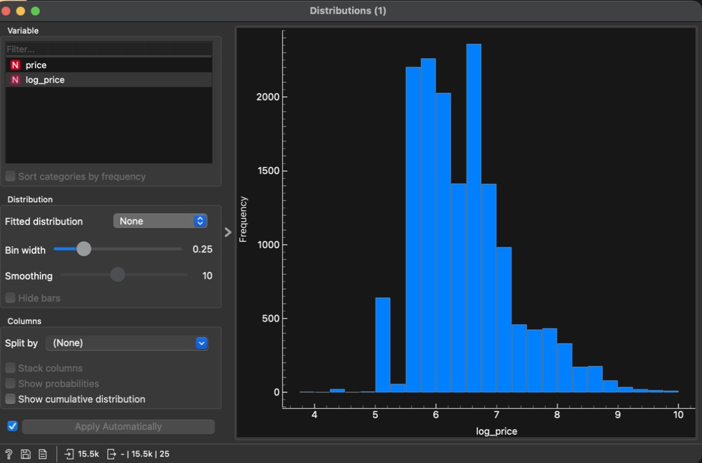
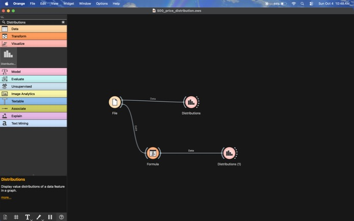

# Step 00 — Raw Audit (State 0)

| | |
|---|---|
| **Goal** | Record the data exactly as downloaded, before any change |
| **Tool** | Python 3.14 + pandas 3.0.6, run by Claude, read-only. To be cross-checked by hand in OpenRefine 3.10.1 ([guide 01](../../guides/01_raw_audit.md)) |
| **Input** | The 3 raw CSVs, checksums in `data/raw/SHA256SUMS.txt` |
| **Changes made** | None |

## 1. Shape

| Measure | Value |
|---|---|
| Rows | 37,273 (15,520 + 11,979 + 9,774) |
| Columns | 5, the same header in all 3 files |
| Malformed rows | 0 (every row has 5 fields) |
| Exact duplicate rows | 0, within or across files |

## 2. Per column

| Column | Blank | Distinct values | Note |
|---|---|---|---|
| `product_title` | 0 | 32,073 | 5,200 rows repeat an earlier title |
| `product_description` | 0 | 12,884 | Only 12,884 distinct texts for 37,273 rows (see §5) |
| `price` | 0 | 341 | All numeric, all > 0 |
| `image_paths` | 0 | 37,273 | One image per row; every path is unique |
| `artform` | **16** | 733 distinct non-blank lists, 204 distinct labels | Multi-label (see §4) |

## 3. Price (the target)

| Statistic | Raw price (₹) | log(price) |
|---|---|---|
| Count | 37,273 | 37,273 |
| Mean | 2,061.11 | — |
| Median | 850 | — |
| Mode | 390 | — |
| Standard deviation | 2,914.86 | — |
| Min / Max | 50 / 37,990 | — |
| Q1 / Q3 | 490 / 2,590 | — |
| 1st / 99th percentile | 190 / 14,490 | — |
| Skewness | **3.61** | **0.51** |
| Kurtosis | 19.25 | — |
| Rows flagged by the 1.5×IQR rule | **3,183** | **10** |

**What this means**

- The mean (2,061) is 2.4× the median (850): a few expensive items pull the mean up. This is the
  textbook case for using the median.
- Skewness drops from 3.61 to 0.51 under a log transform. Modelling `log(price)` is justified by
  data, not assumed. (Planned as stage S5.)
- On the raw scale the IQR rule would call 3,183 rows (8.5%) "outliers". On the log scale, only 10.
  Most "outliers" on the raw scale are just the long tail of a skewed distribution, so outlier
  detection (step 2.9) must run on log(price).
- Only 341 distinct prices, all ending in 0, and 61.7% ending in 90: retail price points, not
  computed costs.

## 4. Art form is multi-label

| Labels per row | Rows |
|---|---|
| 1 | 19,725 |
| 2 | 13,471 |
| 3 | 3,260 |
| 4 | 554 |
| 5 | 227 |
| 6 | 20 |
| Blank / unreadable | 16 |

- 204 distinct labels; 60 of them appear in fewer than 20 rows.
- The most frequent labels are generic and say little about the craft: `handmade` (6,616),
  `natural dyed` (3,969), `fabart` (3,895), `handloom` (3,521), `plain solid` (3,121). Specific
  crafts come next: `ajrakh block printing` (1,752), `pochampally ikat weaving` (1,202), and so on.
- **Effect on the plan:** "split the test set by art form" assumed one art form per row. A rule
  for picking a primary art form is needed first — **decision needed, see §7.**

## 5. Repeated text: variants and templates

| Measure | Value |
|---|---|
| Titles that appear more than once | 2,040 titles, up to 87 times each |
| Rows sharing title **and** price with an earlier row | 4,749 |
| Repeated-title groups whose prices differ | 369 |
| Descriptions used once | 7,180 |
| Descriptions used 2–10 times | 5,199 |
| Descriptions used more than 10 times | 505 (the top one 171 times) |

**Example:** "1 Pocket - Mirror Work Kutch Hand Embroidered Kalash Wall Hanging Letter Holder"
appears more than once at ₹250, each time with a different image. These are **design variants**
of one product, not copying errors, which is why there are no exact duplicates.

**Why it matters:** if one variant ends up in training and its twin in testing, the model sees
the answer during training (leakage) and test scores are inflated. Step 2.4 has to group
variants, and the split has to keep each group on one side.

## 6. Text quality

| Check | Result |
|---|---|
| HTML tags in descriptions | 0 |
| Broken characters (mojibake) | 0 in titles, 0 in descriptions |
| Title length (characters) | mean 58.1, median 56, range 20–154 |
| Description length (characters) | mean 540.2, median 465, range 43–1,611 |

The text is already clean. Step 2.7 (text cleaning) will mostly be a confirmation, not a repair.

## 7. Decisions this audit raises (for the project owner)

| # | Question | Options |
|---|---|---|
| D1 | Primary art form for each multi-label row | (a) the first label in the list; (b) the most specific label, skipping generic ones like `handmade` and `plain solid`; (c) keep all labels as multi-hot features and group the split by a different key |
| D2 | Design variants (same title + price) | (a) keep one per group; (b) keep all, add a `variant_group` ID, and keep each group on one side of the split |
| D3 | The 16 rows with no art form | (a) remove them; (b) infer from the title where it's unambiguous, plus a flag |

The audit doesn't decide these; each goes into the step report where it's applied.

## 8. Cross-check in the tools (2026-10-04)

Done by Claude, driving the apps, following [guide 01](../../guides/01_raw_audit.md). No edits:
OpenRefine Undo/Redo stayed at 0.

**OpenRefine 3.10.1** — project `handicraft_S00_raw`: 3 files, UTF-8, `File` column stored, no
type guessing.

| # | Check | Expected (pandas) | OpenRefine | Match | Evidence |
|---|---|---|---|---|---|
| 1 | Rows per file | 15,520 / 11,979 / 9,774 | 15,520 / 11,979 / 9,774 | ✅ |  |
| 2 | Blank `artform` | 16 | true 16 / false 37,257 | ✅ |  |
| 3 | Distinct `artform` lists | 733 | 733 choices | ✅ |  |
| 4 | Rows in a repeated-title group | 7,240 | true 7,240 / false 30,033 | ✅ |  |
| 5 | Price numeric, range 50–37,990 | all numeric | histogram over 0–38,000 bins; no non-numeric or blank boxes shown | ✅ |  |

**Orange 3.40.0** — workflow
[`S00_price_distribution.ows`](../../tool_exports/orange/S00_price_distribution.ows):
File (`complete_venues_1.csv`, 15,520 rows) → Distributions, and File → Formula
(`log_price := log(price)`) → Distributions. In this version of Orange, Feature Constructor is
called **Formula**.

| Raw price (bin ₹1,000) | log(price) (bin 0.25) |
|---|---|
|  |  |

The raw histogram is one tall bar with a long right tail. Under log it becomes a single hump
centred near 6–7 (about ₹400–1,100), the visual counterpart of skewness falling from 3.61 to
0.51.

## 9. Comparison with the plan

| Planned step | Needed? | Why |
|---|---|---|
| 2.2 Parse price | Minimal | Already numeric; only a type change |
| 2.3 Exact duplicates | No rows removed | 0 found; the step stays, to record that |
| 2.4 Near-duplicates | **Yes, major** | 4,749 title + price repeats |
| 2.5 Missing values | Small | Only 16 blank art forms; no blank prices |
| 2.6 Invalid values | No rows expected | Min price 50, nothing ≤ 0 |
| 2.7 Text cleaning | Light | No HTML or broken characters |
| 2.8 Art-form consolidation | **Yes, major** | Multi-label, 204 labels, 60 rare |
| 2.9 Outliers | Yes, on log scale | 10 candidates on log(price) |
