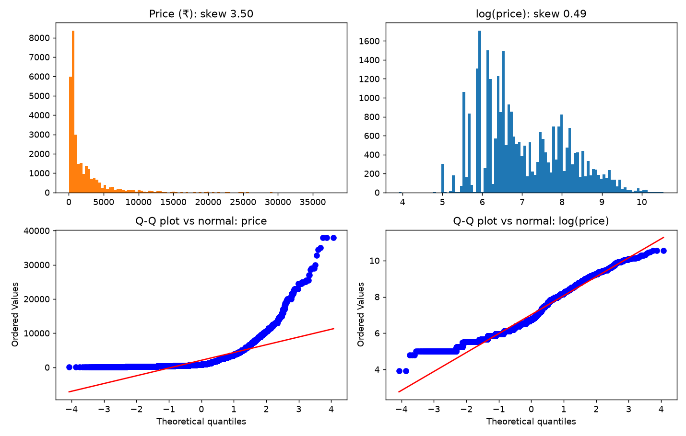
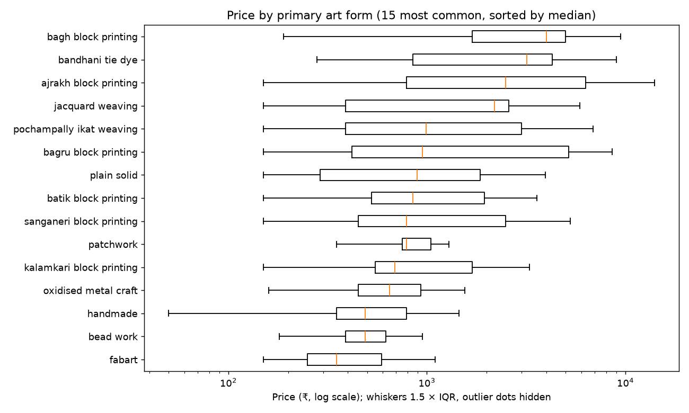
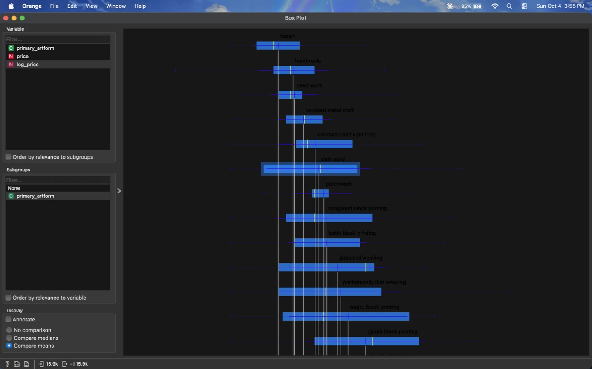
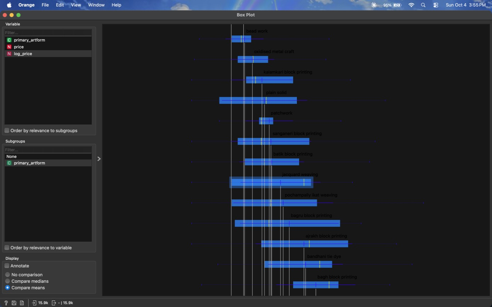
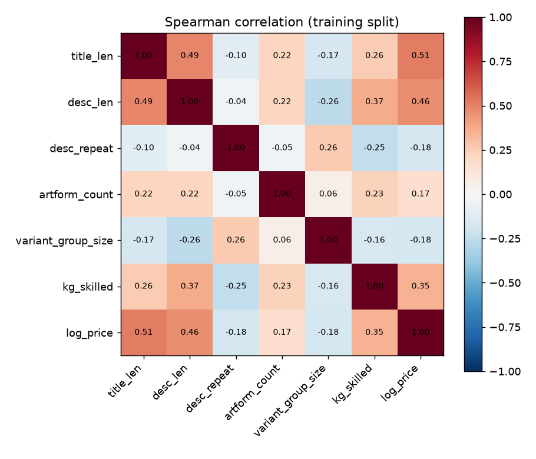
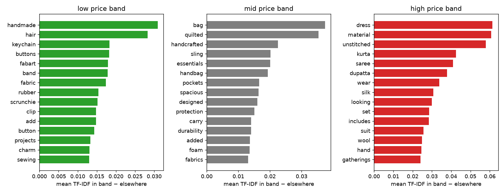

# Part 2 — Statistics and Exploratory Data Analysis

**Syllabus:** supporting analysis. Statistics isn't a named topic in the official syllabus; it underpins Units II–III (probability, model evaluation). See FINAL_REPORT §12.

| | |
|---|---|
| **Data** | Training split only: 29,805 products in 2,065 product families (`data/splits/train.csv`) |
| **Why training only** | The 7,452-row test set stays unseen, so nothing learned here can leak into the test scores |
| **Script** | `scripts/part2_eda.py` (numbers: `reports/eda/part2_eda.json`) |
| **Tool cross-check** | Orange Box Plot: `figures/P2_orange_boxplot_*.jpg`; workflow saved as `P2_boxplot_artform.ows` |
| **Figures** | `figures/P2_price_distribution.png`, `P2_price_by_artform.png`, `P2_correlations.png`, `P2_words_per_band.png` |

> **Order of work.** The raw audit (step 00) came first, but this full statistical analysis was
> written after the models. Where a result here explains an earlier modelling decision, that is
> noted under "What it means for the model".

---

## 1. Price distribution: raw vs log

| Statistic | Price (₹) | log(price) |
|---|---|---|
| Mean | 2,069 | 7.02 (≈ ₹1,117) |
| Median | 850 | 6.75 (= ₹850) |
| Standard deviation | 2,870 | 1.07 |
| Min / Q1 / Q3 / Max | 50 / 450 / 2,690 / 37,990 | 3.91 / 6.11 / 7.90 / 10.55 |
| **Skewness** | **3.50** (strong right tail) | **0.49** (mild) |
| **Excess kurtosis** | **18.6** (very heavy tail) | **−0.60** (lighter than normal) |
| D'Agostino normality test p | < 10⁻³⁰⁰ | < 10⁻³⁰⁰ |

- **Raw price is far from normal.** The mean (₹2,069) is 2.4 × the median (₹850), because a
  few expensive sarees and suits pull it up. On the Q-Q plot the points curve sharply away from the
  line at the top.
- **The log removes most of the skew** (3.50 → 0.49) and the Q-Q plot becomes nearly straight.
- **It still fails the normality test.** With 29,805 rows, even tiny departures are "significant",
  so the test p-value says little here. The skewness, kurtosis and Q-Q plot are the useful
  evidence.
- **Spikes come from "price points".** 61.4% of prices end in 90 (₹390, ₹590, ₹990) and another
  34.8% are multiples of ₹50. The most common prices are ₹390 (1,680 products), ₹450, ₹690 and
  ₹350. Sellers choose from a short list of round numbers, so price isn't a smooth quantity.

## 2. Price by art form

15 most common primary art forms (15,891 rows), sorted by median:

| Art form | Rows | Median ₹ | Q1 ₹ | Q3 ₹ | Mean ₹ |
|---|---|---|---|---|---|
| fabart | 2,475 | 350 | 250 | 590 | 437 |
| bead work | 857 | 490 | 390 | 620 | 595 |
| handmade | 1,360 | 490 | 350 | 790 | 652 |
| oxidised metal craft | 1,465 | 650 | 450 | 930 | 740 |
| kalamkari block printing | 867 | 690 | 550 | 1,690 | 1,062 |
| patchwork | 587 | 790 | 750 | 1,050 | 1,174 |
| sanganeri block printing | 1,283 | 790 | 450 | 2,490 | 1,599 |
| batik block printing | 702 | 850 | 528 | 1,950 | 1,395 |
| plain solid | 949 | 890 | 290 | 1,850 | 1,462 |
| bagru block printing | 758 | 950 | 420 | 5,190 | 2,846 |
| pochampally ikat weaving | 957 | 990 | 390 | 2,990 | 2,835 |
| jacquard weaving | 799 | 2,190 | 390 | 2,590 | 1,856 |
| ajrakh block printing | 1,032 | 2,490 | 790 | 6,290 | 3,933 |
| bandhani tie dye | 1,203 | 3,190 | 850 | 4,290 | 3,163 |
| bagh block printing | 597 | 3,990 | 1,690 | 4,990 | 4,089 |

- **The medians differ by 11 ×**, from ₹350 (fabart) to ₹3,990 (Bagh block printing).
- **The spread also differs.** Patchwork's middle half sits within ₹750–1,050. Bagru's runs from
  ₹420 to ₹5,190, because one art form covers both small accessories and full dress material.
  So art form alone can't fix a price: **what the product is** matters as much as how it is made.

**Orange cross-check (Box Plot widget, log price grouped by primary art form, ordered by mean):**

| | |
|---|---|
|  |  |

Orange agrees at both ends: fabart, handmade and bead work are lowest; Ajrakh, Bandhani and Bagh
are highest. The middle reorders. Orange sorts by **mean log price** and the table by **median**,
and wide groups move: plain solid and jacquard weaving have medians far from their means. That
difference is the skew in section 1, seen inside each group.

## 3. Hypothesis tests: does art form change price?

**H₀:** all art forms have the same price distribution. **H₁:** at least one differs.
Tests run on log price. α = 0.05.

| Test | What it checks | All rows (107 art forms with ≥ 30 rows, 29,410 rows) | One row per family (18 art forms with ≥ 30 families, 1,110 families) |
|---|---|---|---|
| **Levene** | Equal spread in every group? (an ANOVA assumption) | W = 76.2, p < 10⁻³⁰⁰ → **spreads differ** | W = 10.5, p = 10⁻²⁶ → **spreads differ** |
| One-way **ANOVA** | Equal means? (assumes normal groups, equal spread) | F = 236.4, p < 10⁻³⁰⁰ | F = 35.5, p = 10⁻⁹² |
| ANOVA effect size η² | Share of price variance explained by art form | **0.461** | **0.356** |
| **Kruskal-Wallis** | Equal distributions? (rank-based, no normality assumption) | H = 13,304, p < 10⁻³⁰⁰ | H = 396.6, p = 10⁻⁷⁴ |
| Kruskal-Wallis effect size ε² | Share of rank variance explained | **0.450** | **0.348** |

Two-group example, **Mann-Whitney U**: fabart (median ₹350) vs oxidised metal craft (₹650),
U = 850,812, p = 10⁻¹⁷³.

**Reading the results**

1. **H₀ is rejected by every test.** Art form clearly changes price.
2. **Kruskal-Wallis is the main test.** Levene shows the groups have unequal spreads, and section 1
   shows prices aren't normal, so two of ANOVA's assumptions fail. Kruskal-Wallis compares ranks
   and needs neither. Both tests agree, so the conclusion doesn't depend on the choice.
3. **The rows aren't independent.** A family of 30 design variants is really one product priced
   once. Counting it 30 times inflates the evidence. Using **one row per family** (median price)
   gives the honest version. The effect stays highly significant but shrinks: **art form explains
   about 35% of price variance, not 46%**. This is the same problem that forced the grouped test
   split (v3).
4. **p-values printed as 0** in the JSON are below the smallest number the computer can store
   (about 10⁻³⁰⁸). They are reported here as "< 10⁻³⁰⁰".

## 4. Correlations with price

| Feature | Pearson with price | Pearson with log price | Spearman |
|---|---|---|---|
| title length | 0.453 | **0.546** | 0.514 |
| description length | 0.338 | **0.439** | 0.465 |
| skilled technique (KG rule R5, 0/1) | 0.358 | **0.380** | 0.350 |
| number of art-form labels | 0.150 | 0.173 | 0.166 |
| description repeat count | −0.093 | −0.121 | −0.179 |
| design-variant group size | −0.090 | −0.127 | −0.177 |

- **Pearson on raw price understates every link.** Pearson measures straight-line fit, and the
  heavy tail spoils it. On log price, or with Spearman (ranks), all the correlations are stronger.
  This is another reason to model log price.
- **Longer titles mean higher prices** (ρ = 0.51). Expensive items such as sarees and suits have
  long titles ("…Unstitched Dress Material with Dupatta").
- **Skilled techniques cost more** (r = 0.38). The knowledge-graph rule R5 captures real
  information.
- **Mass-listed products are cheaper.** Large variant groups and reused descriptions go with lower
  prices (ρ ≈ −0.18). They are typically small accessories sold in many colours.
- **No single feature is strong** (all |r| < 0.55). A good model has to combine many signals, as
  parts 8–12 do.

## 5. Words per price band, and technique vs price band

Bands use the training tertiles: **low < ₹590 ≤ mid < ₹1,850 ≤ high** (the same cut-offs as the
classifier in part 10 and the bias audit in part 15). Words are ranked by mean TF-IDF inside the
band minus mean TF-IDF in the other two bands.

| Band | 15 most typical words |
|---|---|
| **Low** | handmade, hair, keychain, buttons, fabart, band, fabric, rubber, scrunchie, clip, add, button, projects, charm, sewing |
| **Mid** | bag, quilted, handcrafted, sling, essentials, handbag, pockets, spacious, designed, protection, carry, durability, added, foam, fabrics |
| **High** | dress, material, unstitched, kurta, saree, dupatta, wear, silk, looking, set, includes, suit, wool, hand, gatherings |

The words describe **product types**, not crafts: hair accessories and keychains are cheap, bags
are mid-priced, and clothing (saree, kurta, unstitched dress material, dupatta) is expensive.
Materials appear only in the high band (**silk, wool**). This is why the TF-IDF text features gave
the largest single jump in the experiments (S6b), and why the LLM's item and material attributes
(part 12) helped further.

**Chi-square test of independence: technique family × price band**

| Technique | Low | Mid | High |
|---|---|---|---|
| weaving | 999 | 1,090 | **4,162** |
| tie-dye | 276 | 381 | **749** |
| embroidery | 665 | 617 | 978 |
| printing | 1,574 | 2,041 | 1,785 |
| painting | 724 | 1,032 | 960 |
| metal | 888 | **1,219** | 379 |
| bead work | **635** | 263 | 14 |
| wood | **483** | 351 | 29 |
| other / none | **4,273** | 2,561 | 677 |

χ² = 7,567, 16 degrees of freedom, p < 10⁻³⁰⁰, **Cramér's V = 0.356** (a moderate association).
Weaving and tie-dye lean high; bead work, wood and unlabelled products lean low. The same caution
as section 3 applies: variant families inflate the χ² value. Cramér's V is the more useful number.

---

## What it means for the model

| Finding | Decision it supports | Where it was used |
|---|---|---|
| Price skew 3.5, log skew 0.5 | Predict **log(price)**, convert back to ₹ | Stage S5: RF MAPE 143% → 94% |
| Art form explains ~35% (family level) | Art form is useful but not enough by itself | S4–S7 scores plateau near R² 0.3–0.5 without text |
| Products repeated in variant families | Treat a family as one unit in tests and splits | Grouped split v3, `GroupKFold` tuning |
| Product type and material words separate the bands | Use the text, then cleaner material attributes | S6b TF-IDF (R² 0.707); S10 LLM attributes (0.773) |
| Price spread differs a lot by art form | One fixed error band would be wrong for some groups | Quantile and conformal ranges (part 9) |
| Prices cluster on price points (₹390, ₹590, ₹990) | Predictions should be rounded to price points for display | Possible advisor improvement (not done) |

## Limitations

- **Training split only.** That's deliberate, but the test set could differ slightly. It was
  stratified by art form, so the differences should be small.
- **Effect sizes and p-values count rows, not independent products.** The family-level repeats in
  section 3 correct for this. The chi-square in section 5 wasn't repeated at family level.
- **Words per band are associations, not causes.** "Saree" is not a price driver by itself. It
  stands for size, fabric amount and labour.
