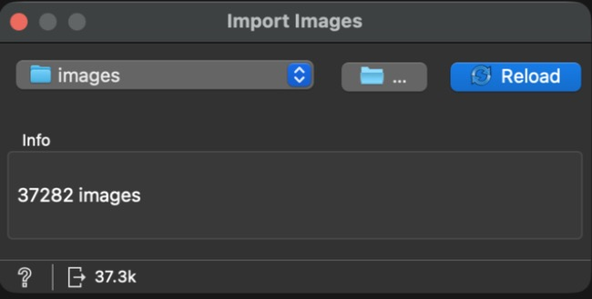
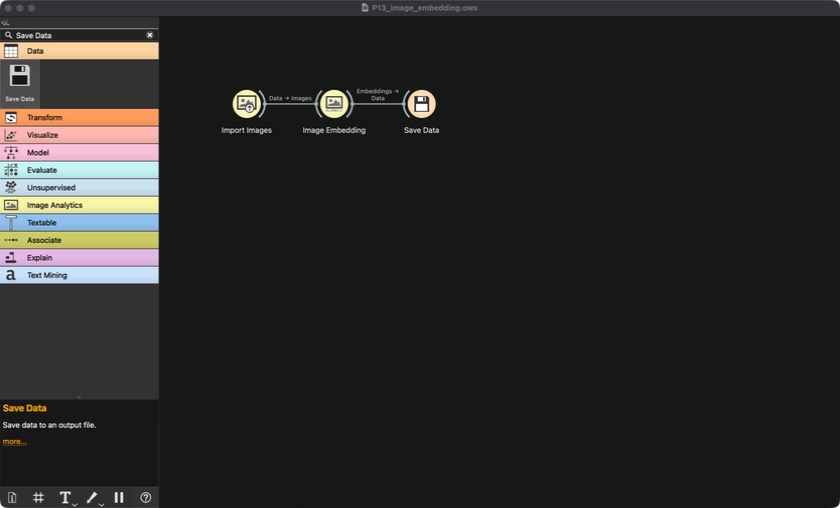

# Part 13 — Image Features from a Pretrained CNN (stage S12-img)

**Syllabus:** Unit V (convolutional neural networks, transfer learning, embeddings).

| | |
|---|---|
| **Images** | 37,282 product photos (1.1 GB) from the same Kaggle dataset, downloaded by the project owner on 2026-10-04 into `data/raw/handicraft/images/` (git-ignored; checksums in `data/raw/IMAGES_SHA256SUMS.txt`) |
| **Tool** | Orange 3.40 + Image Analytics add-on: **Import Images → Image Embedding (SqueezeNet, local) → Save Data**. Workflow `tool_exports/orange/P13_image_embedding.ows`; built by Claude with computer use |
| **Scoring** | `scripts/part13_images.py`, then stage `S12-img` in `scripts/evaluate_stage.py` |
| **Outputs** | `data/features/image_pca.csv.gz` (committed), `reports/models/part13_images.json`, `part13_run.log`; the raw 1,000-column embeddings (306 MB) are git-ignored |

## 1. Image checks (before embedding)

| Check | Result |
|---|---|
| Products with a photo | **37,257 / 37,257** (0 missing) |
| Extra photos | 25, belonging to no product left in the cleaned data (unused) |
| Unreadable files | 0 (every file opened and verified with Pillow) |
| Size | 37,254 are 512 × 512; the rest within 494–512 px |
| Orange Import Images count | 37,282, the same as the checksum list |

## 2. How the photos become numbers: transfer learning

- **SqueezeNet** is a small CNN trained on ImageNet (1.2 million everyday photos, 1,000 classes).
  It's used here as a **fixed feature extractor**: each photo goes through the network once, and
  its 1,000 output values become that photo's **embedding**. Nothing is retrained and no prices are
  involved, so it is label-free, like the TF-IDF vocabulary or the LLM attributes.
- **Why SqueezeNet and not Inception v3 (Orange's default):** Orange's other models, including
  Inception, send every image to Orange's server for embedding. SqueezeNet runs on this Mac, so no
  photo left the machine. It's also light, with 50 × fewer parameters than AlexNet. The trade-off is
  a slightly weaker model.
- **Run:** 37,282 photos in about 35 minutes on the laptop CPU, 0 skipped.

## 3. Compressing the embeddings: PCA (fitted on training photos only)

1,000 columns per product is a lot next to 52 other inputs. PCA was **fitted on the training
photos only** (after standardising) and then applied to all photos. Fitting it on test photos too
would have let the test set shape the features.

| Components | Share of embedding variance kept |
|---|---|
| 16 | 67.8% |
| 32 | 79.7% |
| 64 | 89.0% |
| 128 | 95.4% |

## 4. What do the photos alone know? (image-only Ridge)

Grouped 5-fold CV on training rows (groups = product family):

| Components | 16 | 32 | 64 | 128 | 256 |
|---|---|---|---|---|---|
| CV R² | 0.292 | 0.300 | 0.326 | 0.356 | **0.386** |

Test, scored once with 256 components: **R² 0.375, MAE ₹1,029, MAPE 53.2%**.

That's about as good as all the non-text features together (S5b–S8-only: R² 0.29–0.52). The
network was never told anything about handicrafts or prices, yet its general picture features
separate a keychain from a saree. This model is descriptive only, so the fact that its curve
still rises at 256 doesn't matter here.

## 5. Do the photos add anything beyond the text? (S12 + images)

Same grouped CV, photos added to the full tuned S12 feature set:

| Components added | 0 (S12) | 16 | 32 | 64 | **128** | 256 |
|---|---|---|---|---|---|---|
| CV R² | 0.754 | 0.770 | 0.769 | 0.776 | **0.780** | 0.779 |
| CV MAE ₹ | 656 | 630 | 632 | 625 | **623** | — |

- **Yes. CV R² rises by 0.026.** That's more than every non-text group in the ablation (all under
  0.01), and well above the noise level seen there.
- **128 components is an interior optimum.** The first grid stopped at 128 and 128 won at the edge,
  so the grid was widened to 256. 256 was slightly worse, so 128 was kept.

## 6. Stage S12-img on the frozen test set (scored once)

| Stage | Ridge R² | MAE ₹ | MAPE % | Band F1 | Random Forest R² |
|---|---|---|---|---|---|
| S12 (tuned, text + LLM + KG …) | 0.790 | 646 | 35.9 | 0.811 | 0.564 |
| **S12-img (+ 128 photo components)** | **0.806** | **612** | **34.2** | **0.821** | 0.557 |

**The best model in the project.** From S0: R² 0.269 → **0.806**, MAE ₹1,506 → **₹612**
(−59%), MAPE 152% → **34%**.

Random Forest didn't gain (0.564 → 0.557). The photo components are dense, continuous signals
spread across many columns, which suits a linear model. A forest splitting one column at a time,
already crowded by 20,000 text columns, can't use them well.

## 7. Why the photos help: an interpretation (not tested directly)

The text says *what* a product is. The photo adds *how much of it* and *how detailed*. A full
saree or a set of six is visibly larger than one stole, dense embroidery looks different from
plain fabric, and a hand-painted surface differs from a print. Titles state the size for only 3,075
of 37,257 products (part 12), so the photo often carries information the words leave out.

## Limitations

- **SqueezeNet is a general-purpose, older network.** A larger one (e.g. Inception, ResNet, or a
  CLIP model that relates photos and words) might add more, but would either upload images or need
  new software on this Mac.
- **Photo quality and style vary by seller.** Part of the gain could come from recognising a
  seller's photography style rather than the product (a mild form of the family leakage handled by
  the grouped split). The grouped CV limits this, because whole families are held out together.
- **The advisor demo doesn't use photos.** That would need SqueezeNet at prediction time. Same
  situation as the LLM attributes (part 8b note).
