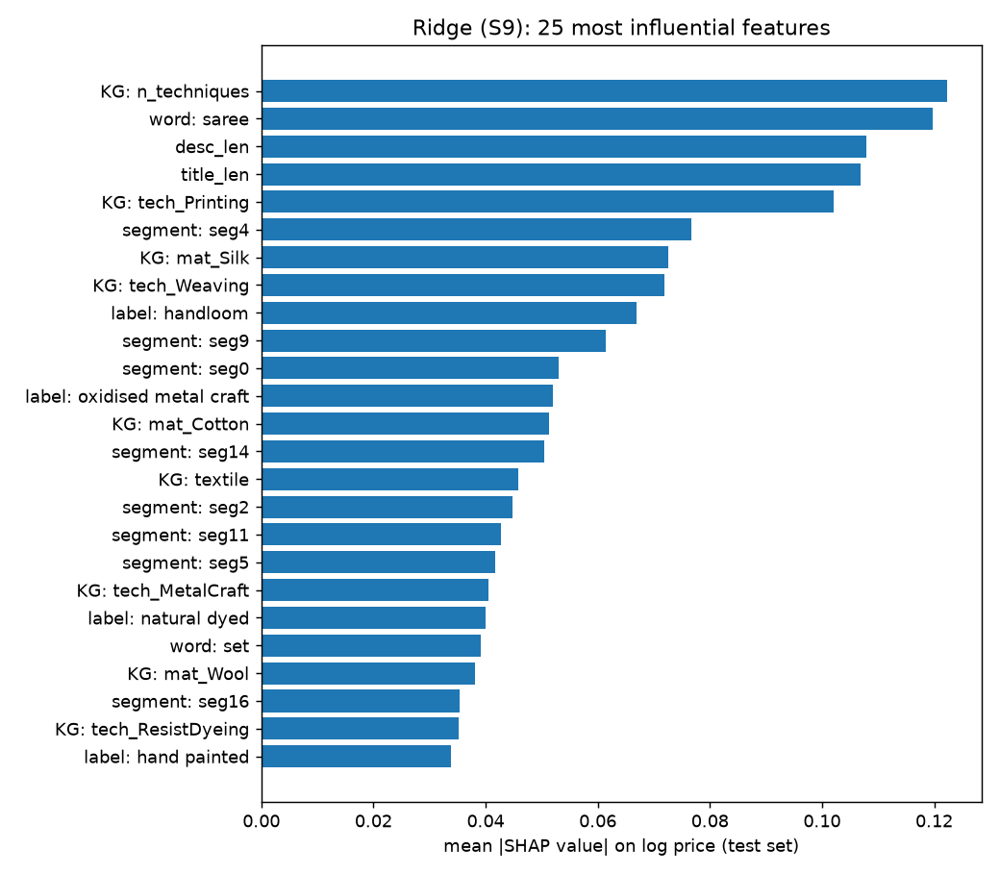
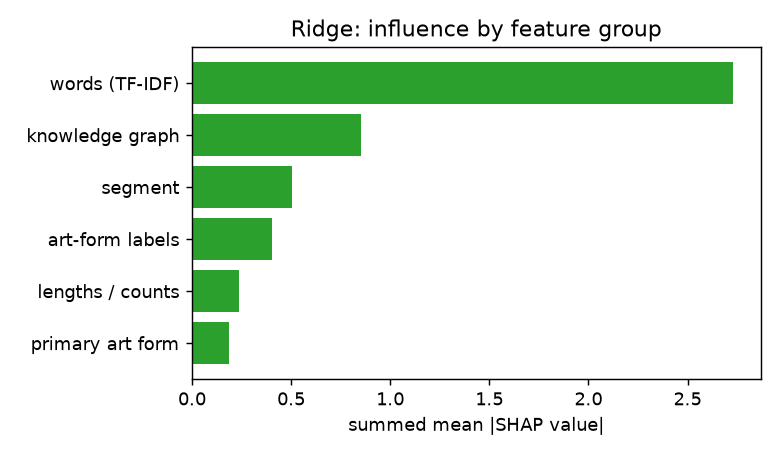
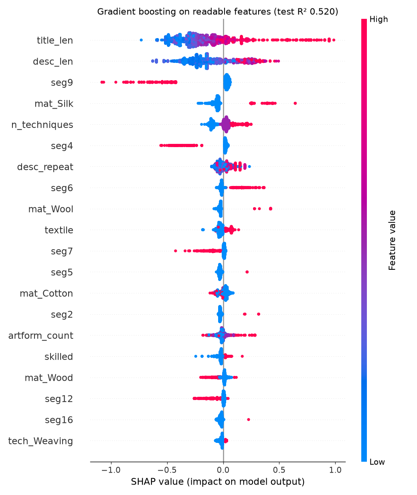
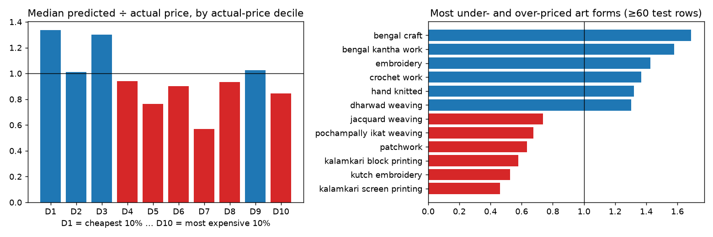
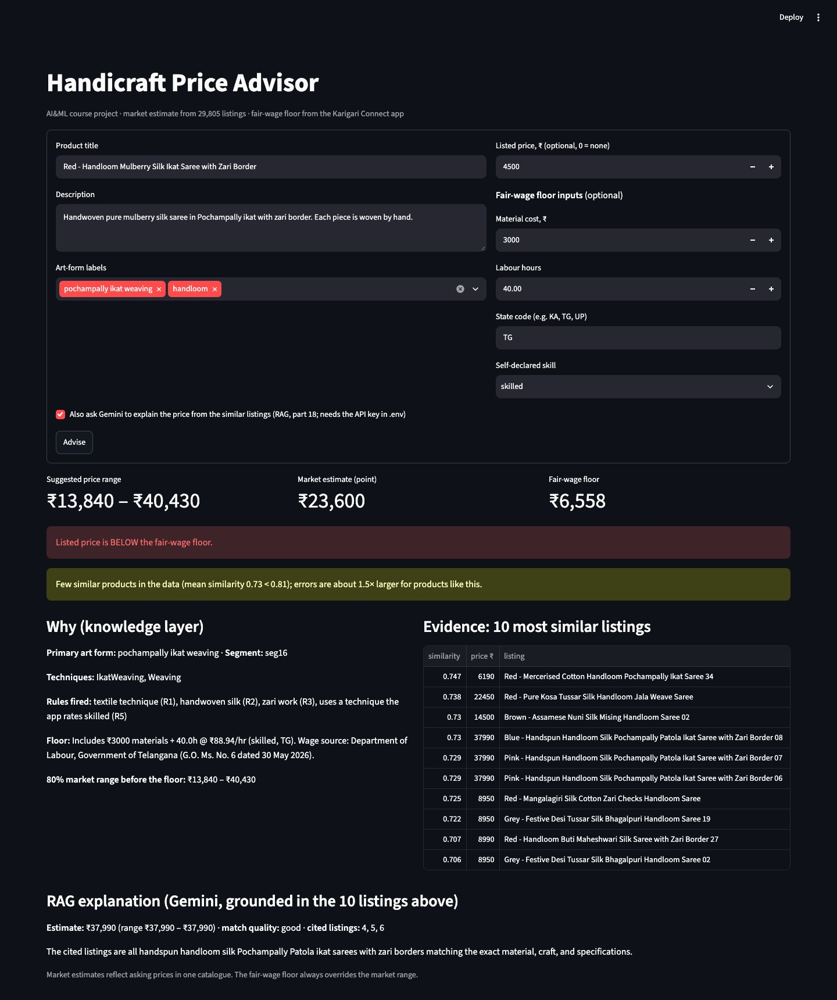

# Parts 8, 14, 15, 16 — Regression Comparison, Explainability, Bias Audit, Price Advisor

All scores are on the frozen test set (split v3, 7,452 products from unseen product families).
Parallel workers capped at 3.

---

## Part 8 — Regression model comparison

**Script:** `scripts/part8_regressors.py`.

- **Target:** log(price); scores reported in rupees.
- **Tuning:** `GridSearchCV`, 5-fold **GroupKFold** on training rows (groups = product family),
  scored by MAE on log price. The test set was used once, after tuning.

| Model | Input | Best setting (CV) | CV MAE (log) | **Test R²** | Test MAE (₹) | Test MAPE (%) |
|---|---|---|---|---|---|---|
| Median baseline | — | — | 0.883 | −0.146 | 1,487 | 73.9 |
| Linear Regression | 20 text dims + 4 numeric | — | 0.567 | 0.347 | 1,066 | 60.6 |
| Polynomial Regression (degree 2) | same 24 inputs | — | 0.475 | 0.577 | 893 | 48.7 |
| **Ridge** | S9 sparse (labels, TF-IDF, KG, scaled numeric) | α = 3 | **0.343** | **0.748** | **692** | **37.5** |
| Decision Tree | dense (SVD + KG + numeric + segment) | depth 8, min leaf 20 | 0.534 | 0.413 | 1,084 | 70.2 |
| Random Forest (300 trees) | dense | min leaf 2 | 0.409 | 0.608 | 837 | 48.8 |
| Gradient Boosting | dense | lr 0.1, 31 leaves | 0.368 | 0.675 | 798 | 44.6 |
| KNN (cosine) | text SVD | k = 5, distance-weighted | 0.406 | 0.633 | 796 | 40.9 |
| Average of Ridge + Gradient Boosting | — | — | — | 0.747 | 696 | 37.7 |

**Findings**

- **Ridge wins**, at every metric and in cross-validation. With 5,000+ sparse word features and
  30k rows, a regularised linear model beats every tree model.
- **Polynomial vs Linear on the same 24 inputs:** R² 0.347 → 0.577. Pairwise interactions (for
  example "silk" × "length of description") carry real signal.
- **Ensembles vs a single tree:** Decision Tree 0.413 → Random Forest 0.608 → Gradient
  Boosting 0.675.
- **Averaging Ridge with Gradient Boosting doesn't help** (0.747 vs 0.748): their errors overlap.
- **Honesty note:** cross-validation chose α = 3 (test R² 0.748), while S9 used α = 1 and scored
  0.752 on test. The test set is never used to choose settings, so **0.748 is the properly tuned
  figure**, and α = 3 is what the advisor uses.

---

## Part 14 — Explainability (SHAP)

**Script:** `scripts/part14_shap.py`. shap 0.52.0.

**A. Ridge (the best model).** For a linear model, SHAP value = weight × (feature value − its
training mean), computed for every test product. Checked against `shap.LinearExplainer` on
200 products: **maximum difference 0.0**, so the two are identical.

| Influence by feature group (sum of mean \|SHAP\|) | Value |
|---|---|
| Words in title + description (TF-IDF) | 2.73 |
| Knowledge-graph features | 0.85 |
| Text segment (part 5) | 0.50 |
| Art-form labels | 0.40 |
| Lengths / counts | 0.24 |
| Primary art form | 0.19 |

| Top 25 features | By group |
|---|---|
|  |  |

**Words that raise / lower the predicted price most** (Ridge weights on TF-IDF)

| Raise | Lower |
|---|---|
| saree, necklace, frame, set, 3pc, heavy, mats, ajrakh saree, table runner, painting | keychain, nosepin, ring, fabric, earrings, kurtas, napkin, art silk, cotton fabric, dupattas |

"Fabric" and "art silk" lower the price: fabric sold by the metre and imitation silk are cheaper
than finished goods and pure silk. The model learned that distinction from the text.

**Per-product explanations** (each effect as % change on the predicted price):

| Product | Actual | Predicted | Main reasons |
|---|---|---|---|
| Reusable Bishnupur Handpainted Terracotta Rakhi | ₹490 | ₹334 | segment 4 (rakhis) −48%; label hand painted −24%; clay −23% |
| Handcrafted Fabric Jhola Bag | ₹1,590 | ₹795 | segment 5 (bags) +23%; title length −17%; weaving −16% |
| Sukriti Handmade Classic Notebook with Pencil | ₹690 | ₹497 | paper craft −39%; paper material +26%; printing −20% |
| Jacquard Embroidered Cotton 3pc Dress Material | ₹3,290 | ₹3,022 | segment 14 +33%; number of techniques +21%; "3pc" +15% |

**Caution when reading single weights:** some knowledge-graph features overlap (weaving appears
as a label, a technique and a segment). Ridge splits credit between overlapping features, so a
single weight can look "wrong", e.g. weaving −16% on a jacquard item. Group totals are more
reliable than single weights.

**B. Gradient boosting on readable features only** (KG + lengths + segment, no word features):
test R² 0.520, explained with `shap.TreeExplainer`:



---

## Part 15 — Bias audit

**Script:** `scripts/part15_bias.py`.

- **Model:** Ridge α = 3, on the test set.
- **Measure:** **median ratio = predicted ÷ actual price.** 1.0 is unbiased; below 1 means the
  model prices the group too low.
- **"Under-priced 30%":** share of products predicted at less than 70% of their real price.

**Overall:** median ratio **0.953**, MAPE 37.5%.

**By actual price (deciles)**

| Decile | Median price (₹) | Median ratio | MAPE (%) | Under-priced 30% |
|---|---|---|---|---|
| D1 (cheapest) | 250 | **1.336** | 61.8 | 0.0% |
| D2 | 450 | 1.012 | 37.3 | 12.4% |
| D3 | 580 | 1.302 | 55.0 | 4.4% |
| D4 | 750 | 0.942 | 23.0 | 7.0% |
| D5 | 850 | 0.764 | 35.4 | 43.7% |
| D6 | 990 | 0.901 | 24.9 | 28.0% |
| D7 | 1,590 | **0.568** | 40.9 | **65.9%** |
| D8 | 2,450 | 0.935 | 33.9 | 35.3% |
| D9 | 3,690 | 1.027 | 43.1 | 25.8% |
| D10 (dearest) | 7,890 | 0.845 | 26.6 | 28.2% |



**By art form** (≥ 60 test rows)

| Most **under**-priced | Ratio | Under-priced 30% | | Most **over**-priced | Ratio |
|---|---|---|---|---|---|
| kalamkari screen printing | **0.461** | 95.8% | | bengal craft | 1.687 |
| kutch embroidery | 0.527 | 92.8% | | bengal kantha work | 1.578 |
| kalamkari block printing | 0.580 | 91.2% | | embroidery (generic label) | 1.427 |
| patchwork | 0.635 | 52.4% | | crochet work | 1.367 |
| pochampally ikat weaving | 0.675 | 53.6% | | hand knitted | 1.320 |

**Other groups**

| Group | Median ratio | MAPE |
|---|---|---|
| Generic label only (handmade, fabart, …) | 0.906 | 30.0% |
| Specific craft label | 0.967 | 39.3% |
| Skilled technique (rule R5) | 1.067 | 41.5% |
| Not rated skilled | 0.929 | 35.9% |
| Description shared by ≥ 10 listings | 0.914 | 35.3% |
| Wood craft | 1.708 | 57.5% |

**Findings**

1. **Pull toward the middle.** The cheapest items are over-priced (D1 ×1.34). Items in the
   ₹850–1,600 range are under-priced (D7 ×0.57; two thirds predicted at under 70% of their real
   price). A regression model trained on a skewed market drifts toward typical prices.
2. *(Superseded by the revision below: mostly one product family.)* **Specific traditional crafts are undervalued.** Kalamkari, Kutch embroidery and Pochampally
   ikat are predicted at 46–68% of their real price, and over 90% of kalamkari and Kutch items
   are under-priced by more than 30%. These are the products a fair-pricing tool exists to
   protect.
3. **The bias isn't just "expensive = under-priced".** Skilled-technique products are, at the
   median, slightly *over*-priced (1.067), and the dearest decile is closer to fair (0.845) than
   D7. The under-pricing concentrates in specific crafts and price points that resemble cheaper
   items in text, such as a kalamkari bag vs an ordinary printed bag.

**Ethics: what this means for using the model**

- The model learns **what the market charges, not what the work is worth**. If the market
  underpays a craft, a model trained on it will repeat that.
- So the model may **never set the floor**. In the advisor (part 16), the Karigari Connect
  fair-wage floor (official wage notification × labour hours + materials) always overrides the
  market range.
- The advisor **warns** when a product's art form is one the audit found under-priced (median
  ratio < 0.85): "Treat the range as a lower bound."
- **Data limits that can cause bias:** asking prices from one retailer; generic labels on 6,434
  rows; no costs or labour hours; no region. None of these can be fixed by modelling. They need
  better data.

### Revision (2026-10-04): audit by product family, and on the final model

**Why.** Re-running the audit on the final model (S12-img) showed that every "most under-priced"
art form had a median test price of exactly ₹1,590. **453 of the 524 test products at ₹1,590 are
one product line, "Handcrafted Fabric Jhola Bag"**, sold in hundreds of prints labelled kalamkari,
Pochampally, bandhani and others. The model prices that bag at about ₹800. Counting it hundreds of
times made several crafts look systematically undervalued. This is the same problem as split
leakage and the EDA tests: rows from one family are not independent evidence.

**Fix.** A family-level table was added to `scripts/part15_bias.py`: one row per product family
(its median ratio), art forms with at least 5 test families. Run on both models: `part15_bias.json`
(part 8 Ridge) and `part15_bias_final.json` (S12-img). Per-product ratios are in `part15_rows*.csv`.

**The named crafts, rechecked**

| Art form | Test rows | Families | Ratio by product (part 8 → final) | Ratio by family (part 8 → final) | Verdict |
|---|---|---|---|---|---|
| kalamkari screen printing | 72 | 2 | 0.46 → 0.46 | 0.54 → 0.63 | 65 of 72 rows are the bag; says nothing about the craft |
| Kutch embroidery | 69 | 5 | 0.53 → 0.48 | 1.21 → 1.10 | One large family is under-priced; the craft as a whole isn't |
| Pochampally ikat | 222 | 25 | 0.67 → 0.69 | 1.10 → 1.04 | **No craft-wide bias** |
| **kalamkari block printing** | 216 | 8–11 | 0.58 → 0.65 | **0.61 → 0.74** | **Holds up across families** |

**Art forms under-priced at family level** (≥ 5 families, ratio < 0.85)

- Part 8 Ridge: hand painted 0.61, kalamkari block printing 0.62, blue art pottery 0.64, screen
  printing 0.76, Banaras weaving 0.77, Bengal jamdani 0.79, Lucknowi chikankari 0.80, Bengal kantha
  0.82, Srikalahasti kalamkari 0.84.
- Final S12-img: hand painted 0.73, blue art pottery 0.74, **kalamkari block printing 0.75**, Bengal
  jamdani 0.80, Lucknowi chikankari 0.83.

**Pull toward the middle: confirmed at family level, and smaller in the final model**

| Families by price (fifths) | Cheapest | 2 | 3 | 4 | Dearest |
|---|---|---|---|---|---|
| Part 8 Ridge | 1.31 | 1.01 | 0.94 | 0.95 | 0.86 |
| **Final S12-img** | **1.13** | 1.03 | 1.00 | 0.95 | **0.89** |

Overall, across 510 test families, the final model's median ratio is **1.017** (no general bias).
The deep dip at ₹1,590 (decile D7, ×0.58) is about half the bag family. Without it, D7 is ×0.86.

**Corrected findings**

1. **Pull toward the middle is real**: cheap families over-priced, expensive ones under-priced. The
   final model reduces it (cheapest ×1.31 → ×1.13).
2. **Undervaluation is concentrated, not general.** A handful of crafts are under-priced across
   several families: hand painting, blue pottery, **kalamkari block printing**, Bengal jamdani,
   Lucknowi chikankari. The earlier claims about Pochampally ikat and Kutch embroidery as crafts
   don't hold. They came from one or two large product families.
3. **Lesson:** a bias audit has the same independence problem as a test split. Audit per family,
   or one popular product line decides the result.

**Effect on the advisor (Part 16).** `train_advisor.py` now reads the family-level table, so the
"under-priced craft" caution needs at least 5 families of evidence. Checked: a Pochampally saree no
longer gets the caution, and a kalamkari block-print dupatta does ("62% of the real price across 8
product families"). The demo screenshot below predates this change and still shows the old
Pochampally caution.

---

## Part 16 — Price advisor agent and demo

**Files**

- `scripts/train_advisor.py` trains and saves the models (`models/advisor.joblib`, 6.4 MB;
  `models/advisor_faiss.bin`, 11.9 MB)
- `app/advisor.py` holds the decision logic
- `app/streamlit_app.py` is the web page

**Run:**

```bash
cd ml_price
```

```bash
.venv/bin/streamlit run app/streamlit_app.py
```

**Agent design (PEAS, Unit I)**

| | |
|---|---|
| **Performance** | A range that contains the market price about 80% of the time; never below the fair-wage floor; cautions where the model is known to be weak |
| **Environment** | A new handicraft listing; market knowledge from 29,805 training listings |
| **Actuators** | Suggested range, point estimate, verdict on a listed price, cautions, evidence table, explanation |
| **Sensors** | Title, description, art-form labels; optional listed price, material cost, labour hours, state, self-declared skill |

**How it decides (knowledge-based layer + learned layer)**

1. **Rules (knowledge layer):** the knowledge-graph rules (`kg_rules.py`) give techniques,
   materials and rule facts R1–R5. The art-form → technique map also selects the app's technique
   ids for the skill floor.
2. **Market estimate (learned layer):** Ridge (α = 3) gives the point price. The **80% range**
   is ×0.586 to ×1.713 of it, from family-grouped out-of-fold errors (part 9).
3. **Evidence:** FAISS returns the 10 most similar training listings with their prices (part 11).
4. **Fair-wage floor:** if material cost, hours and state are given, the advisor calls the
   **Karigari Connect** `calculate_price` (backend code, imported read-only, not modified). If no
   verified wage rate exists, the floor is "unavailable", never guessed.
5. **Decision:** suggested range = market range, raised to the floor if the floor is higher.
6. **Cautions:**
   - mean similarity of the top-10 matches below **0.805** (the 25th percentile for unseen
     families) → "few similar products, errors about 1.5× larger"
   - art form under-priced in the part 15 audit (ratio < 0.85) → "treat as a lower bound"
   - whole market range below the floor → "market prices don't cover the labour"
7. **Verdict on a listed price:** below floor → below half the estimate → above double →
   normal.

**Example run** (shown in the screenshot)

> **Input:** Red handloom mulberry silk ikat saree with zari border; labels pochampally ikat
> weaving + handloom; listed ₹4,500; materials ₹3,000; 40 hours; Telangana; skilled.
>
> - **Rules fired:** textile (R1), handwoven silk (R2), zari (R3), skilled technique (R5)
> - **Market estimate:** ₹23,600; **80% range:** ₹13,840 – ₹40,430
> - **Fair-wage floor:** ₹6,558 = ₹3,000 + 40 h × ₹88.94/h (skilled, TG), citing the Telangana
>   wage order
> - **Verdict:** listed price is **below the fair-wage floor**
> - **Cautions:** few similar products (similarity 0.73 < 0.81); the model under-prices
>   Pochampally ikat (68% of real price)
> - **Evidence:** 10 similar sarees, ₹6,190 – ₹37,990



**Constraints respected**

- The fair-wage floor is never guessed.
- The model never overrides the floor.
- The Karigari Connect backend is used read-only, not changed.
