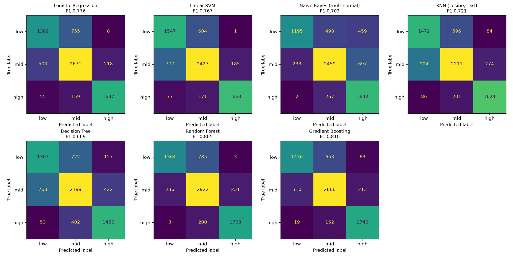

# Parts 9–11 — Price Range, Classifier Comparison, Similar-Items Search

All results are on the frozen test set (split v3, 7,452 products, unseen product families).
Shared feature code: `scripts/features.py`, fitted on training rows only.

---

## Stage S9 (found while building part 9): feature scaling

The part 9 code standardised the numeric features (mean 0, sd 1) before Ridge; the scoring
harness hadn't. Added as stage S9:

| | Ridge R² | MAE (₹) | MAPE (%) |
|---|---|---|---|
| S8 (numeric features unscaled) | 0.714 | 735 | 40.9 |
| **S9 (numeric features standardised)** | **0.752** | **691** | **37.3** |

Ridge applies one penalty to all weights. Unscaled columns, such as description length in the
hundreds, are penalised unevenly against TF-IDF columns between 0 and 1. Scaling makes the
penalty even.

The same change made **unregularised Linear Regression collapse** (R² −7.5 × 10⁸): some
knowledge-graph columns are exact duplicates, and least squares without a penalty becomes
unstable. See [EXPERIMENTS.md](../../EXPERIMENTS.md).

---

## Part 9 — A price range instead of one number

**Script:** `scripts/part9_quantile.py`. **Target:** an 80% range, so the true price should
fall inside it for about 80% of new products.

**Models**

| Method | How |
|---|---|
| Quantile gradient boosting | Three `HistGradientBoostingRegressor` models with quantile loss predict the 10th, 50th and 90th percentile of log(price). Features: text SVD (100 dims), KG features, lengths, segment |
| + conformal calibration (CQR) | Widen the raw range by the 80th percentile of out-of-fold "how far outside the range" scores. Folds grouped by product family. Widening = 0.235 on the log scale (about ×1.26 each side) |
| Ridge + fixed band | S9 Ridge prediction × the 10th/90th percentile of its own out-of-fold errors |

**Results**

| Method | Coverage (target 80%) | Below / above range | Median width (₹) | Width ÷ predicted price | Point R² | Point MAE (₹) |
|---|---|---|---|---|---|---|
| Quantile GBM (raw) | **58.3%** ❌ | 20.1% / 21.6% | 1,019 | 1.00 | 0.602 | 794 |
| **Quantile GBM + conformal** | **83.2%** ✅ | 7.7% / 9.1% | 1,552 | 1.54 | 0.602 | 794 |
| Ridge + fixed band | 77.2% | 9.9% / 12.9% | 961 | 1.15 | **0.752** | **691** |

**Coverage by price band**

| Band | Raw quantile | + conformal | Ridge band |
|---|---|---|---|
| low | 44.9% | 78.1% | 78.5% |
| mid | 71.7% | 89.9% | 78.3% |
| high | 54.9% | 79.6% | 74.0% |

**Findings**

- **Raw quantile models are overconfident on new products.** They promise 80% and deliver 58%.
  They learn their ranges from training rows, where near-copies make prices look easier to
  predict than they are for genuinely new products.
- **Conformal calibration fixes the promise** (83%) using out-of-fold errors grouped by family:
  the same "no near-copies" rule as the split. The cost is a wider range.
- **The simple Ridge band is nearly as well calibrated** (77%), narrower, and comes with the
  better point estimate. It is the practical choice for the advisor (part 16); the conformal
  version is the safer one when the range must hold.

**Examples (conformal range)**

| Product | Price (₹) | Range (₹) |
|---|---|---|
| Kutch Bandhani Handwoven Merino Wool Shawl with Zari | 4,990 | 2,080 – 15,390 |
| Hand Embroidered Thread & Bead Work Rakhi | 490 | 350 – 1,090 |
| Kumaun Hand Knitted Acrylic Woolen Socks - Kids | 890 | 700 – 2,680 |
| Ceramic Hand Glazed Plates (Set of 4) | 2,190 | 280 – 2,050 ❌ (above range) |

---

## Part 10 — Price-band classifier comparison

**Script:** `scripts/part10_classifiers.py`.

- **Target:** low / mid / high band. Cut points ₹590 and ₹1,850 (training tertiles). Test
  counts 2,152 / 3,389 / 1,911.
- **Tuning:** `GridSearchCV`, 5-fold **GroupKFold** on the training set (groups = product
  family), scored by macro-F1. Test set used once, after tuning.

| Model | Input | Best setting | CV F1 | Test acc. | Precision | Recall | **Test F1** | ROC-AUC |
|---|---|---|---|---|---|---|---|---|
| **Gradient Boosting** | dense (SVD + KG) | lr 0.05, 300 iter | 0.779 | **0.811** | 0.819 | 0.808 | **0.810** | **0.925** |
| Random Forest | dense | min leaf 5 | 0.772 | 0.804 | 0.826 | 0.797 | 0.805 | 0.916 |
| Logistic Regression | sparse (S9) | C = 10 | 0.759 | 0.773 | 0.781 | 0.774 | 0.777 | 0.911 |
| Linear SVM (calibrated) | sparse | C = 1 | 0.729 | 0.756 | 0.767 | 0.768 | 0.767 | 0.899 |
| KNN (cosine) | text SVD | k = 5, distance-weighted | 0.733 | 0.712 | 0.717 | 0.729 | 0.721 | 0.840 |
| Naive Bayes (multinomial) | TF-IDF | α = 0.1 | 0.720 | 0.711 | 0.728 | 0.713 | 0.703 | 0.865 |
| Decision Tree | dense | depth 8, min leaf 5 | 0.659 | 0.665 | 0.667 | 0.672 | 0.669 | 0.806 |

**Findings**

- **Ensembles win:** Gradient Boosting (0.810) and Random Forest (0.805) beat every single model,
  and both beat a lone Decision Tree by about 0.14 F1. That is the variance-reduction argument
  for ensembles, measured.
- **Mistakes are between neighbouring bands.** Random Forest confused low with high only
  6 times out of 7,452. A wrong band is usually "one step off".
- **Naive Bayes over-predicts "high"** (459 low items called high). Its independence assumption
  double-counts correlated words such as "handwoven" and "handloom".
- **CV F1 is close to test F1 for every model** (within about 0.04). The grouped cross-validation
  is honest; plain K-fold would have let near-copies leak between folds, as split v1/v2 did.
- Price-band F1 has improved from 0.534 (S0) to **0.810**.

---

## Part 11 — Similar-items search (vector index)

**Script:** `scripts/part11_similar_items.py`.

- **Index:** FAISS `IndexFlatIP`, exact inner-product search, holding 29,805 training vectors
  (text SVD, 100 dims, unit length, so inner product = cosine similarity). Saved as
  `tool_exports/faiss_train_index.bin`.
- **Query:** a test product's vector → its k most similar training listings and their prices.

**Neighbours' median price as an estimate**

| k | R² | MAE (₹) | True price inside neighbours' 25–75% range |
|---|---|---|---|
| 1 | 0.517 | 848 | — |
| 5 | 0.596 | 839 | 33.2% |
| **10** | **0.613** | **827** | 37.4% |
| 25 | 0.578 | 840 | 48.8% |

**Retrieval quality tracks error**

| Mean similarity of the top 10 | Median relative error |
|---|---|
| Lowest quarter | **40.0%** |
| Low | 26.0% |
| High | 23.1% |
| Highest | 26.6% |

**Example: what a user would see**

> **Test product:** Multicolor - Zoya Wooden Beads Earrings with German Silver Birds — ₹390
>
> | Similarity | Price | Similar listing |
> |---|---|---|
> | 0.84 | ₹550 | Multicolor - German Silver Wooden Beads Necklace Set 86 |
> | 0.82 | ₹490 | Orange - Rasha German Silver Jhumki Earrings with Wooden Elephant |
> | 0.82 | ₹490 | Orange - Naaz German Silver Jhumki Earrings with Wooden Elephant |
> | 0.81 | ₹550 | Multicolor - Handmade Wooden Bird Beaded Necklace Set 02 |
>
> Middle half of the 10 neighbours' prices: ₹340 – 535.

**Findings**

- As a price estimate, retrieval (R² 0.61) is below Ridge (0.75), but every answer comes with
  **checkable evidence**: real listings and their prices. This is the retrieval step of RAG.
- The neighbours' middle-half range is too narrow to be a confidence interval (37% coverage).
  Use part 9 for ranges and part 11 for evidence.
- **Low similarity means low trust:** when even the best matches are weak, the error is about
  1.5× higher. The advisor (part 16) will say "few similar products found — treat with caution"
  in that case.
- Compared with "copy the single nearest price" from the split check (R² 0.255 with plain
  TF-IDF): the SVD vectors and a 10-neighbour median are much stronger (0.613).
