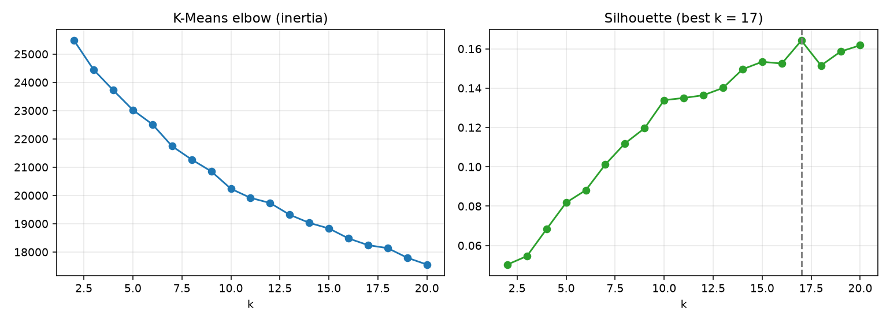
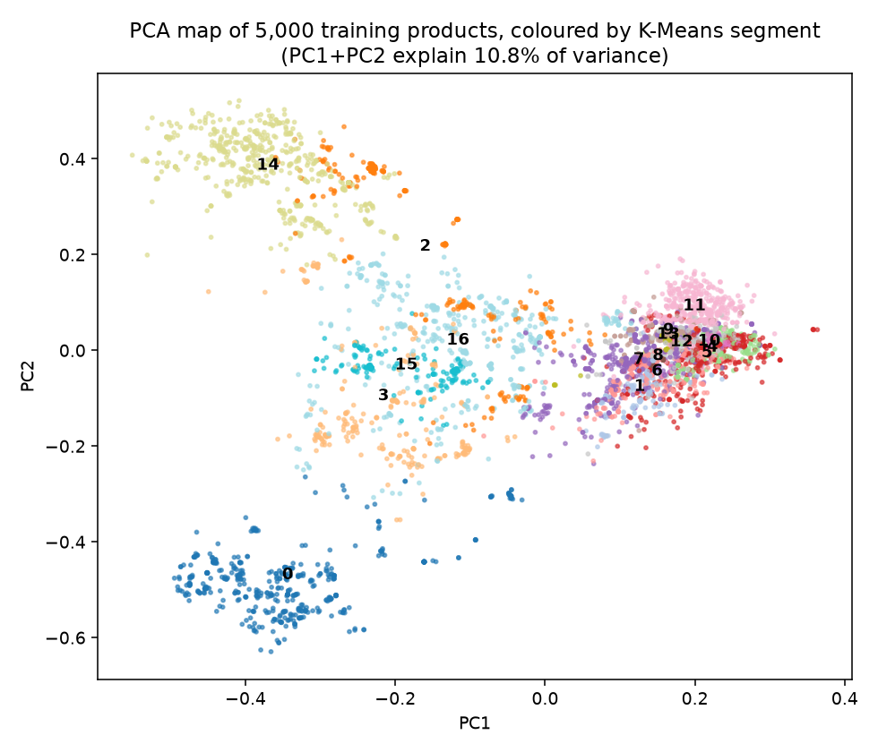
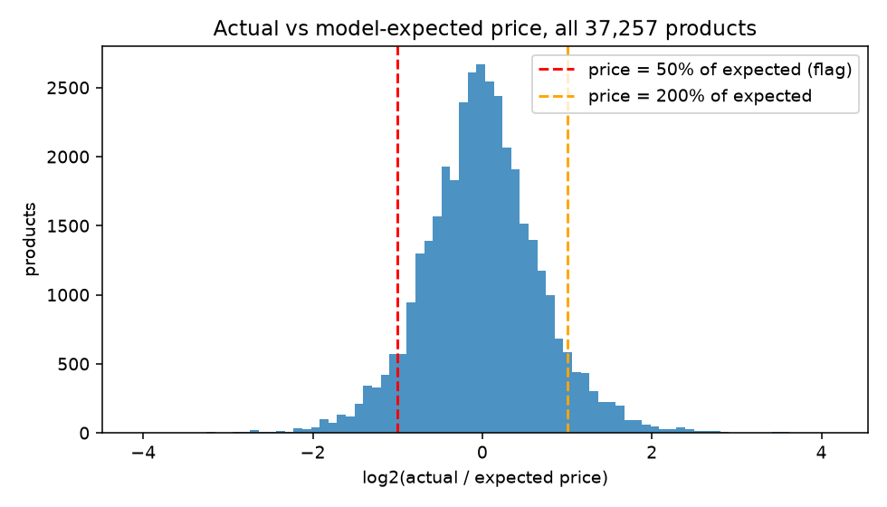

# Unsupervised Learning — Parts 5, 6, 7

**Syllabus:** Unit IV (distance measures, K-Means, Hierarchical, DBSCAN, PCA, Apriori,
anomaly detection).
**Data:** training split v3 (29,805 rows) unless stated. **Tools:** scikit-learn 1.9.1,
mlxtend 0.25.0.
**Scripts:** `scripts/segmentation.py`, `scripts/apriori_rules.py`, `scripts/underpricing.py`.

---

## Part 5 — Market segmentation

**Representation.** Each product's title and description were turned into:

1. TF-IDF (20,000 terms)
2. TruncatedSVD to 100 dimensions (latent semantic analysis; keeps 54.2% of the variance)
3. normalised to unit length

On unit-length vectors, Euclidean distance = √(2 − 2·cosine similarity), so K-Means groups
products by text similarity.

**Distance measures compared** (5,000-row sample: how often do two metrics pick the same
nearest neighbour?)

| Pair | Agreement |
|---|---|
| Euclidean vs cosine | 93.5% |
| Euclidean vs Manhattan | 87.8% |
| Manhattan vs cosine | 81.2% |

Euclidean and cosine mostly agree, as expected on normalised vectors; Manhattan diverges most.

**Three algorithms compared**

| Algorithm | Setting | Clusters | Silhouette | Mean intra-cluster distance | Mean inter-centroid distance |
|---|---|---|---|---|---|
| **K-Means** | k chosen by silhouette over 2–20 | **17** | **0.164** | 0.690 | 0.885 |
| Hierarchical (Ward) | same k, 5,000-row sample | 17 | 0.146 | 0.661 | 0.931 |
| DBSCAN | eps = 50th pct of 10-NN distance | 128 | 0.641 (non-noise) | — | — |
| DBSCAN | eps = 70th pct | 97 | 0.412 | — | — |
| DBSCAN | eps = 90th pct | 33 | 0.132 | — | — |

DBSCAN noise share at those three settings: 43.9%, 23.5%, 5.2%.

| Elbow and silhouette | PCA map |
|---|---|
|  |  |

**Reading the results**

- Silhouettes are low (0.15–0.16). Product text forms overlapping groups, not crisp ones. The
  silhouette keeps rising slowly with k, with no sharp elbow.
- DBSCAN shows the trade-off clearly. A tight eps finds 128 very dense groups (silhouette 0.64)
  but labels 44% of products as noise; these groups are the near-copy families that split v3
  keeps together. A loose eps leaves only 5% noise, but the clusters blur (0.13).
- **K-Means was chosen for the segment feature:** it assigns every product, and it can assign
  new (test) products to the nearest centre.

**The 17 segments, cheapest to most expensive** (training rows)

| Seg. | Rows | Median price (₹) | Top terms | Main art forms |
|---|---|---|---|---|
| 13 | 623 | 250 | buttons, sewing, scrapbooking | fabart, handmade |
| 9 | 1,357 | 290 | hair, band, scrunchie, clip | fabart, handmade |
| 4 | 1,471 | 590 | rakhi | meenakari, bead work |
| 11 | 2,665 | 590 | earrings, silver, necklace | oxidised metal craft |
| 12 | 2,024 | 590 | beadwork, toran, hanging | bead work |
| 1 | 996 | 650 | notebook, paper, recycled | handmade stationery |
| 7 | 3,340 | 690 | handcrafted, table, wood | handmade, wood carving |
| 5 | 2,273 | 790 | bag, sling, quilted | patchwork, kalamkari |
| 8 | 252 | 790 | lacquered, babool, wood, hanger | lacquer craft |
| 10 | 496 | 850 | handbag, zippered, lining | kalamkari, bandhani |
| 6 | 2,121 | 1,100 | handpainted, painting, madhubani | Madhubani, Kerala mural |
| 16 | 2,670 | 2,450 | silk, cotton, fabric, saree | plain solid, phulkari |
| 14 | 3,044 | 2,590 | perfection, flaws, irregularity | jacquard, Pochampally ikat |
| 3 | 1,302 | 2,800 | kota doria, sanganeri, block print | Sanganeri, Kota Doria |
| 0 | 2,693 | 2,890 | block, natural dyed, print, defects | Ajrakh, Bagru |
| 15 | 992 | 2,990 | tie, bandhani, kutch, satin | Bandhani, Shibori |
| 2 | 1,486 | 3,850 | wool, merino, stole, handwoven | hand knitted |

- The segments are product types, and their median prices span **₹250 to ₹3,850**.
- Segment 14 is held together by the seller's standard handloom disclaimer ("irregularities are
  the beauty of handwoven…"), so boilerplate text can define a segment.

**As a feature (stage S8):** segment id added to S7 → Ridge R² **0.714** (best so far), MAE ₹735,
band F1 0.786. Without word features (S8-only), the price-band F1 rises from 0.612 to 0.673.

---

## Part 6 — Association rules (Apriori)

**Baskets:** one per training product, holding:

- its art-form labels (`AF:`)
- its materials (`MAT:`)
- its technique groups (`TECH:`)
- its price band (`BAND:low/mid/high`; cut points ₹590 and ₹1,850, the training tertiles)

224 distinct items. Minimum support 1% (about 298 products). This gives 647 frequent itemsets
and 1,083 rules with confidence ≥ 0.5 and lift ≥ 1.5. All rules:
`reports/unsupervised/apriori_all_rules.csv`.

**What predicts the HIGH price band** (above ₹1,850; a random product is in it ⅓ of the time)

| Rule | Support | Confidence | Lift |
|---|---|---|---|
| Wool + Weaving → high | 0.026 | 0.995 | 3.05 |
| handloom + Wool → high | 0.026 | 0.995 | 3.05 |
| Lucknowi chikankari → high | 0.010 | 0.994 | 3.04 |
| Silk + Painting → high | 0.012 | 1.000 | 3.06 |
| Wool + Printing → high | 0.014 | 0.995 | 3.05 |
| Silk + Zari + Weaving → high | 0.014 | 0.949 | 2.91 |

**What predicts the LOW band** (below ₹590)

| Rule | Support | Confidence | Lift |
|---|---|---|---|
| fabart + Cotton → low | 0.034 | 0.923 | 2.62 |
| fabart → low | 0.084 | 0.796 | 2.26 |
| bead work → low | 0.031 | 0.642 | 1.82 |
| wood carving → low | 0.012 | 0.640 | 1.82 |
| NaturalFibreCraft → low | 0.012 | 0.649 | 1.84 |

**Craft → material rules, and what they revealed**

| Rule | Confidence | Lift | Verdict |
|---|---|---|---|
| handmade stationery → Paper | 0.887 | 16.1 | ✅ real |
| wood carving → Wood | 0.982 | 5.7 | ✅ real |
| Mangalagiri / Dharwad weaving → Cotton | 1.000 | 1.9 | ✅ real |
| **Srikalahasti penwork kalamkari → Bamboo** | 0.670 | 26.8 | ❌ the *pen* is bamboo, not the product |
| **Bagru block printing → Wood** | 0.772 | 4.5 | ❌ the printing *blocks* are wooden |
| **Oxidised metal craft → Silver** | 0.911 | 12.3 | ❌ listings say "German silver", an alloy without silver |

Apriori exposed a real flaw in the keyword-based material extraction (KG features, part 3):
keywords catch **tool** and **alloy** words as materials. Reported as found, not hidden. This is
the case for part 12 (LLM attribute extraction), which can tell "printed with wooden blocks"
from "made of wood".

---

## Part 7 — Underpricing detector

**Method**

1. **Expected price** for every product from the best model (S8 Ridge). Training rows get
   5-fold out-of-fold predictions, with folds grouped by product family, so a product never helps
   predict itself. Test rows use the full training model.
2. **Ratio** = actual / expected.
3. **Flag** "possible underpricing" when the ratio is below 0.5 (less than half of expected).
4. **Cross-check** with the Isolation Forest flags from step 2.9.

| Result | Value |
|---|---|
| Products checked | 37,257 |
| Flagged under (< 50% of expected) | **2,421 (6.5%)** |
| Over (> 200% of expected), for comparison | 2,597 (7.0%) |
| Median ratio | 1.001 |
| Training rows flagged by both this and Isolation Forest | 9 (of 1,952 and 293) |

**Highest flag rates** (art forms with ≥ 100 rows)

| Art form | Rows | Flagged | Share |
|---|---|---|---|
| mandala art | 147 | 69 | 46.9% |
| patwa thread work | 313 | 133 | 42.5% |
| patua folk art | 112 | 40 | 35.7% |
| leather puppetry | 110 | 34 | 30.9% |
| crochet work | 331 | 101 | 30.5% |
| dokra craft | 316 | 72 | 22.8% |

**Examples**

| Product | Price (₹) | Expected (₹) | Likely reason |
|---|---|---|---|
| Fish - Tholu Bommalata Leather Puppet Wall Hanging | 150 | 2,149 | Small piece; the text doesn't state size, so the model prices it like a large puppet |
| Butterfly - Tholu Bommalata Leather Puppet Wall Hanging | 250 | 2,285 | Same |
| Sri Aurobindo Ashram - Floating Candle (Big) | 50 | 842 | Consumable item in a "handmade" group of mostly larger goods |

**Honest reading**

- Under-flags (6.5%) and over-flags (7.0%) are nearly symmetric, and the median ratio is 1.00.
  **Most flags reflect model error** (typical error about 41%), not proven underpricing.
- The detector finds where the model is least sure, mostly small items whose size isn't
  in the text.
- It barely overlaps the Isolation Forest (9 rows). The two measure different things: price vs
  model expectation, and price vs the art form's usual range.
- **Proper use:** a review queue for a coordinator, never an automatic verdict. The dataset has
  no cost or labour data, so it can't say what a *fair* price is. In Karigari Connect, fair price
  comes from the wage-floor formula, not from this model.
- **Improvement path:** size and quantity attributes (part 12) should cut the false flags on
  small items.

Flags for every row: `data/features/underpricing_flags.csv`.
